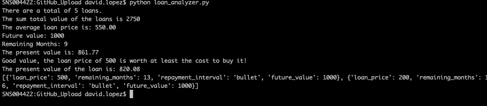

# Loan Analyzer Application - Challenge 01

This is a python application which uses some of the fundamentals (print, conditionals, lists, dictionaries, functions) that were taught in the first module of the FinTech Bootcamp.
The application works by analyzing a list of loans, and calculating and outputting the present value. Addittionally, it looks through a dictionary of loan types, and writes to a file `inexpensive_loans.csv` the loans which are less than or equal to $500.

The csv file format is:

```
"loan_price", "remaining_months", "repayment_interval", "future_value"
```

---

## Technologies

This challenge uses python 3.7 and the [csv](https://docs.python.org/3/library/csv.html#module-csv) and [pathlib](https://docs.python.org/3/library/pathlib.html#module-pathlib) modules, which are [built-in](https://docs.python.org/3/py-modindex.html).

---

## Installation

Clone this repo, and cd into the `GitHub_Upload` directory. Then run:

```
python loan_analyzer.py
```

Output should look similar to below, and you should see the .csv file `inexpensive_loans.csv` written in same directory after execution.



---

## Contributors

[David Lopez](https://github.com/sububer)

---

## License

MIT
